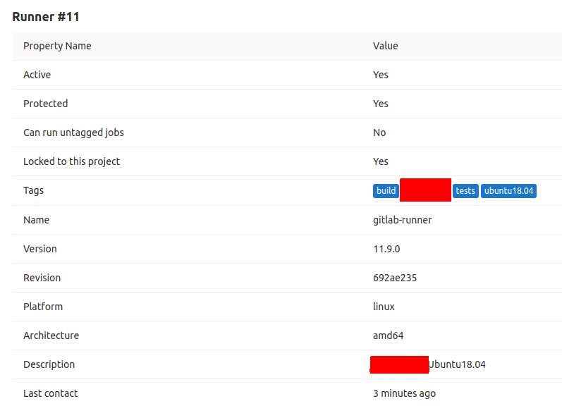

# Gitlab CI/CD Example for C++-based Apps

![pipeline status][1] ![coverage report][2]

## CONTENTS

* [DEPENDENCIES](#dependencies)
* [SETUP](#setup)
* [USAGE](#usage)
* [ISSUES](#issues)
* [DOCUMENTATION](#documentation)

## DEPENDENCIES

* The main requirements are:
    * Ubuntu 16.04
    * `cmake 3.5.1`
        * `g++ 5.4.0` (needed by CMake to compile `CXX` files)
    * `googletest 1.8.1`
        * `git 2.7.4` (for downloading `googletest` within CMake)
        * `libpthread-stubs0-dev 0.3-4` (for linking `pthread`)
    * `lcov 1.12` (for generating code coverage)
    * Access to a Gitlab instance
    * Access to a build/test/server PC for `gitlab-runner`

## SETUP

* Setup the Local Test Environment
    * Using your own Ubuntu system
        * Install `gcc`, `cmake`, `git`, and `pthread`
            ```
            $ sudo apt-get update
            $ sudo apt-get install g++=4:5.3.1-1ubuntu1
            $ sudo apt-get install lcov=1.12-2
            $ sudo apt-get install cmake=3.5.1-1ubuntu3
            $ sudo apt-get install git=1:2.7.4-0ubuntu1.6
            $ sudo apt-get install libpthread-stubs0-dev=0.3-4

            ```
        * Build the application and the tests
            ```
            $ cd build
            $ cmake ..
            $ make -j8

            ```
    * Using **Docker**
        * Create a Docker image from the [Dockerfile](./Dockerfile)
            ```
            docker build --tag sample-ci-cpp .
            docker run -it sample-ci-cpp:latest /bin/bash

            ```
* Setup Gitlab CI
    * [Install a Gitlab Runner](https://docs.gitlab.com/runner/install/) on a publicly-accessible machine
    * [Register the Runner](https://docs.gitlab.com/runner/register/index.html) with your Gitlab instance
        * Get the coordinator URL and registration tokens:
            * For shared runners: <http://your/gitlab/instance/admin/runners>
            * For project-specific runners: <http://your/gitlab/project/settings/ci_cd>
        * Use [Docker as the executor](https://docs.gitlab.com/runner/executors/docker.html) (see [ISSUES](#issues) section on possible disk space issue)
        * Set project-specific [tags](https://docs.gitlab.com/ee/ci/runners/#using-tags)
    * Configure the CI configuration in [.gitlab-ci.yml](./gitlab-ci.yml)
        * Set which Docker [image](https://docs.gitlab.com/runner/executors/docker.html#the-image-keyword) and [services](https://docs.gitlab.com/runner/executors/docker.html#the-services-keyword) to use
        * Set the [tags](https://docs.gitlab.com/ee/ci/runners/#using-tags)
        * Set the commands for `before_script` and `script`
        * For other configurations, see [GitLab CI/CD Pipeline Configuration Reference](https://docs.gitlab.com/ee/ci/yaml/)
    * Configure the Gitlab Runner at *Gitlab project* > *Settings* > *CI/CD*
        * Select *Disable AutoDevOps* to explicitly require *.gitlab-ci.yml*
        * Enable the runner only for "important" commits
            * Enable only on tagged jobs
            * Enable only on protected branches (ex. `develop`, `master`)
        * Set other options such as *Timeout*, *Custom CI config path*, and *Triggers*
        * Sample Configuration:
            

## USAGE

* Run the Tests on Local
    * Run the tests
        ```
        $ cd build
        $ ./bin/calculator_tests
        [==========] Running 3 tests from 2 test cases.
        [----------] Global test environment set-up.
        [----------] 1 test from AddTest
        [ RUN      ] AddTest.ValidNumbers
        [       OK ] AddTest.ValidNumbers (0 ms)
        [----------] 1 test from AddTest (0 ms total)

        [----------] 2 tests from DivTest
        [ RUN      ] DivTest.ValidNumbers
        [       OK ] DivTest.ValidNumbers (0 ms)
        [ RUN      ] DivTest.InvalidNumbers
        [       OK ] DivTest.InvalidNumbers (0 ms)
        [----------] 2 tests from DivTest (0 ms total)

        [----------] Global test environment tear-down
        [==========] 3 tests from 2 test cases ran. (1 ms total)
        [  PASSED  ] 3 tests.

        ```
    * Check code coverage
        ```
        $ cd build
        $ cd CMakeFiles/calculator_tests.dir/
        $ lcov --directory . --capture -o coverage.info
        $ lcov -r coverage.info */build/* */tests/* */c++/* -o coverageFiltered.info
        $ lcov --list coverageFiltered.info

        ```
* Run the Tests on Gitlab
    * Make changes in *src/* and in *tests/*
    * Make changes to the [.gitlab-ci.yml](./gitlab-ci.yml) configuration (if necessary)
    * Commit the changes then push to Gitlab
    * Go to the *Gitlab project* > *CI/CD* > *Pipelines*
    * Select the currently *running* job to view progress/result
    * It is possible to download the job log by clicking on the *Raw* button

## ISSUES

* The tests and the code coverage does not seem to be using latest src and tests
    * Delete the *build* directory then re-create it
        ```
        $ rm -Rf build
        $ mkdir build
        $ touch .gitkeep

        ```
* "*This job is stuck, because you don’t have any active runners that can run this job.*"
    * Make sure that the *.gitlab-ci.yml* has the correct tags
    * Make sure the `gitlab-runner` service is running
    * Make sure the machine running `gitlab-runner` is accessible by the Gitlab instance
* "*yaml invalid*"
    * Go to the *Gitlab project* > *CI/CD*
    * On the top-right portion, click the *CI Lint* button
    * Paste the contents of *gitlab-ci.yml* file and validate
* The `gitlab-runner` is leaving a lot of `-cache-` containers/volumes
    * See a [discussion](https://gitlab.com/gitlab-org/gitlab-runner/issues/2980#note_106845694) of this behavior here
    * Possible solutions:
        * Manually regularly run `docker system prune`
        * Setup a `cron` job `docker system prune -f`
            ```
            # Cleanup docker containers/volumes every 3am every monday
            0 3 * * 1 /usr/bin/docker system prune -f

            ```

## DOCUMENTATION

* On Setting-Up CMake
    * [Introduction to CMake by Examples](http://derekmolloy.ie/hello-world-introductions-to-cmake/)
* On Setting-Up GoogleTest
    * [GoogleTest Primer](https://github.com/google/googletest/blob/master/googletest/docs/primer.md)
    * [How to start working with GTest and CMake](https://stackoverflow.com/q/8507723/2745495)
* On Setting-Up lcov
    * [Build a C ++ Practical Unit Test Environment with GoogleTest + CMake](https://qiita.com/imasaaki/items/0021d1ef14660184f396)
* On Setting-Up Gitlab CI
    * [Getting started with GitLab CI](http://192.168.1.61/help/ci/quick_start/README)
    * [Installing a Gitlab Runner](https://docs.gitlab.com/runner/install/)
    * [Registering a Gitlab Runner](https://docs.gitlab.com/runner/register/index.html)
    * [Configuring a Gitlab Runner](https://docs.gitlab.com/runner/#configuring-gitlab-runner)
    * [.gitlab-ci.yml Reference](https://docs.gitlab.com/ee/ci/yaml/README.html)
* On Setting-Up Docker Registry
    * [Deploy a registry server](https://docs.docker.com/registry/deploying/)
    * [Test an insecure registry](https://docs.docker.com/registry/insecure/)

[1]: http://192.168.1.61/commonpf/sample-ci-cpp/badges/master/pipeline.svg
[2]: http://192.168.1.61/commonpf/sample-ci-cpp/badges/master/coverage.svg
